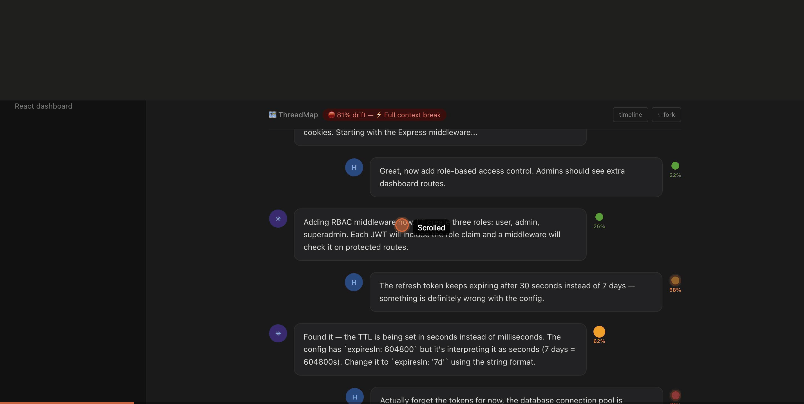
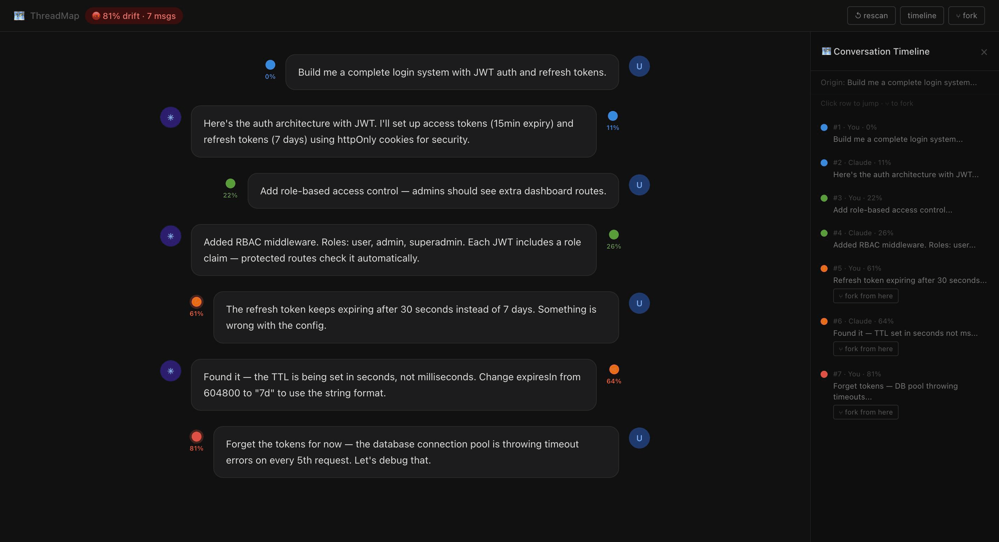

# 🗺️ ThreadMap MCP for Claude

**Conversation drift visualization and forking for Claude.**

> Stop losing your original intent. See exactly where your conversation drifted. Fork from any point and pick up with clean context.

---

## See it in action

**Color dots on every message — live drift tracking:**



**Timeline panel with fork buttons at every inflection point:**



---

## Two ways to use ThreadMap

| | MCP Server | Chrome Extension |
|---|---|---|
| **Works in** | Claude Code (terminal) | claude.ai (browser) |
| **Install** | `claude mcp add threadmap npx threadmap-mcp` | Load unpacked from `chrome-extension/` folder |
| **What you get** | 7 tools — track, timeline, fork, branch | Color dots on every message, timeline panel, one-click fork |
| **Best for** | Developers building with Claude Code | Anyone using claude.ai daily |

Both are in this repo. Use one or both.

---

## Chrome Extension — Visual dots in claude.ai

The Chrome extension injects ThreadMap directly into the claude.ai interface. No config. Just install and open Claude.

### Install (2 minutes)

```
1. Clone or download this repo
2. Open Chrome → chrome://extensions
3. Enable Developer mode (top right toggle)
4. Click Load unpacked → select the chrome-extension folder
5. Open any Claude conversation — ThreadMap activates automatically
```

### What you see

- **Color dot** next to every message showing drift % from your original intent
- **Sticky bar** at the top with live drift status and message count
- **↺ rescan** — loads all messages from long previous conversations
- **timeline** — full conversation map, click any row to jump to that message
- **⑂ fork** — opens a new Claude chat with full context pre-loaded in the input

### How forking works

1. Click **⑂ fork** in the timeline or next to any message bubble
2. A new claude.ai tab opens automatically
3. The full context (origin intent + all messages up to that point) is pasted into the input
4. Review and hit Send — Claude picks up from the clean version

### Chrome extension files

```
chrome-extension/
├── manifest.json     — Extension config (Manifest v3)
├── content.js        — Core drift engine + DOM injection
├── threadmap.css     — All injected styles
├── popup.html        — Extension popup with color legend
├── icon16.png        — Icons
├── icon48.png
└── icon128.png
```

> **Heads up:** The extension uses Developer mode (load unpacked). A Chrome Web Store version is on the roadmap.

---

## MCP Server — Claude Code integration

The MCP server adds 7 tools to Claude Code for programmatic drift tracking.

### Install

```bash
claude mcp add threadmap npx threadmap-mcp
```

Or manually add to `~/.claude/claude_desktop_config.json`:

```json
{
  "mcpServers": {
    "threadmap": {
      "command": "npx",
      "args": ["threadmap-mcp"]
    }
  }
}
```

### Quick start

```
threadmap_track(sessionId="myproject", role="user", content="build me a login system with JWT auth")
→ 🔵 Blue — Drift: 0% — Origin intent set

threadmap_track(sessionId="myproject", role="user", content="the refresh token keeps expiring after 30 seconds")
→ 🟠 Orange — Drift: 63% — ⚡ INFLECTION POINT detected

threadmap_timeline(sessionId="myproject")
→ Full color-coded map of all messages with fork instructions

threadmap_fork(sessionId="myproject", messageIndex=6, branchName="jwt-debug")
→ 🌿 Branch created — clean context from messages 1–7
```

### All 7 tools

| Tool | What it does |
|------|-------------|
| `threadmap_track` | Track a message, get drift score + color |
| `threadmap_timeline` | Full color-coded conversation map |
| `threadmap_fork` | Fork from any message index |
| `threadmap_branch_context` | Clean context packet for any branch |
| `threadmap_status` | Quick current drift check |
| `threadmap_reset` | Archive thread, start fresh |
| `threadmap_legend` | Show color reference guide |

---

## Color system

| Color | Drift | Meaning |
|-------|-------|---------|
| 🔵 Blue | 0–15% | On track — core intent |
| 🟢 Green | 16–35% | Productive expansion |
| 🟡 Yellow | 36–55% | Adjacent drift |
| 🟠 Orange | 56–72% | **Inflection point** — meaningful pivot |
| 🔴 Red | 73–88% | Full context break |
| 🟣 Purple | 89–95% | Meta — talking about the conversation |
| ⚪ White | 96–100% | Resolution |

Orange and Red = fork candidates. The conversation has left your original intent behind.

---

## Real-world use cases

**Claude Code — architecture integrity**
Track every message while building. Orange = scope creep. Fork before the drift gets worse. Architecture decisions from the first 10 messages stay clean.

**Long previous conversations**
Click ↺ rescan in the Chrome extension. ThreadMap scrolls to the top, loads all messages, scans every one, then returns you to the bottom — all dots appear.

**Team handoffs**
Use `threadmap_branch_context` to extract a clean summary of what was decided. Paste it into a new session — no scrolling through 200 messages.

---

## Why open source?

Non-linear conversation navigation is the missing primitive for AI-native work. Right now Claude conversations are books with no table of contents, no chapters, no bookmarks.

ThreadMap is the table of contents. If this becomes the standard, it travels across Claude, GPT, Gemini, anything. Nobody owns it. Everybody benefits.

---

## Roadmap

- [ ] Local embedding model (MiniLM) for richer semantic scoring
- [ ] Chrome extension on Chrome Web Store (no developer mode required)
- [ ] Cross-session persistence (SQLite mode)
- [ ] Visual timeline export (SVG/HTML)
- [ ] GPT / Gemini compatibility

---

## Contributing

MIT licensed. See [CONTRIBUTING.md](./CONTRIBUTING.md).

```bash
git clone https://github.com/Advertflair/threadmap-mcp
cd threadmap-mcp
npm install
npm run build
```

PRs welcome especially for: better drift scoring, Chrome extension improvements, and other AI platform support.

---

## License

MIT — see [LICENSE](./LICENSE)

---

*Built by [Advertflair](https://advertflair.com). Open source. Ship it.*
